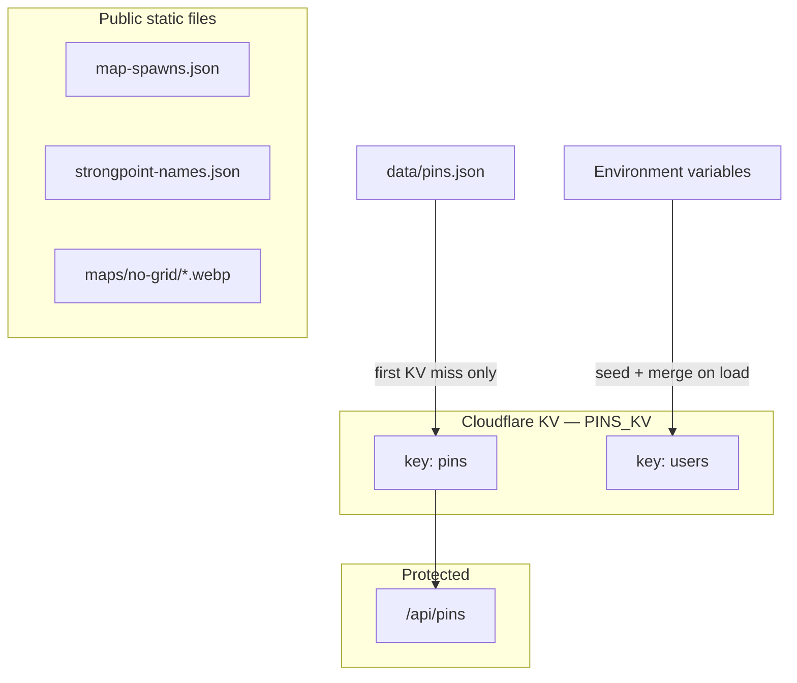

# Data Schemas & Storage

Where HLL Tactika keeps its data and how seed files relate to production.



| Storage | Contents |
|---------|----------|
| **KV `PINS_KV`** | Live pins (`"pins"`) + member list (`"users"`) |
| **`data/pins.json`** | Seed pins — copied to KV on first deploy only |
| **`data/map-spawns.json`** | Map metadata, strongpoints (public) |
| **`data/strongpoint-names.json`** | Sector label overlays (public) |
| **`maps/`**, **`assets/`** | Images, fonts, logos — see [folder-structure.md](folder-structure.md) |
| **Session cookie** | `hll-tactika-session`, 7d HMAC — see [api.md](api.md) |
| **`localStorage`** | Per-browser UI prefs (`hll-tactika-*` keys in [js/state.js](../js/state.js)) |

---

## Seed vs live — cheat sheet

| Data | First production deploy | After deploy |
|------|-------------------------|--------------|
| **Pins** | `data/pins.json` → written to KV `"pins"` | KV only; git changes to seed file have no effect |
| **Users** | Env vars merged into KV `"users"` | KV + env merge on every load |
| **Map JSON / images** | Served from repo | Update via git deploy |
| **Sessions** | Per browser | Per browser |

To reset live pins to seed: delete KV key `"pins"` — next request re-seeds from [data/pins.json](../data/pins.json).

---

## Cloudflare KV

Binding: `PINS_KV` in [wrangler.toml](../wrangler.toml). Two keys only:

| Key | Module | Contents |
|-----|--------|----------|
| `"pins"` | [pins-store.js](../functions/lib/pins-store.js) | Full pin catalog JSON |
| `"users"` | [users-store.js](../functions/lib/users-store.js) | `{ users[], revoked[] }` |

**Pins:** KV empty → clone seed, write to KV, return. KV populated → authoritative. Saves replace the whole document (last-write-wins). Without KV (local dev): in-memory seed, lost on restart. `/data/pins.json` blocked by [middleware](../functions/_middleware.js).

**Users:** Env vars merged on every load via `migrateEnvUsers`. KV written only when migration detects changes. Owners/admins resolved from env at runtime — see [roles.md](roles.md#configuration).

---

## Pin catalog

Top-level shape (KV `"pins"` and [data/pins.json](../data/pins.json)):

```json
{ "defaultMapId": "SMDMV2", "pins": { "<mapId>": [ /* Pin[] */ ] } }
```

Map IDs: 20 tactical maps — see [README](../README.md#maps--attribution). Only maps with entries in `pins` show tricks.

### Pin fields

| Field | Notes |
|-------|-------|
| `id` | Auto `pin-<uuid>` on create if omitted |
| `title` | **Required**, non-empty |
| `description` | Optional text |
| `tag` | Default `"climb"`; `"mg-spot"` for MG positions |
| `x`, `y` | **Required** — map % (0–100), top-left origin on 1920×1920 image |
| `videoUrl` | Legacy single-video field |
| `thumbnail` | Legacy preview image URL |
| `faction` | Default `"neutral"` — `axis` / `allies` / `neutral` (MG arrow colour) |
| `requires` | Optional object — see below |
| `mediaItems` | Preferred: `[{ kind: "image"\|"video", url }]` — empty URLs stripped |
| `dirX`, `dirY` | **Required for `mg-spot`** — arrowhead %; must differ from `x`/`y` |
| `createdBy` | Steam ID64 or `null` for seed pins |
| `createdByName` | Display name; resolved on read if missing |

Pins without `mediaItems`, `videoUrl`, or `thumbnail` render **yellow** on the map — see [user-guide.md](user-guide.md).

**MG spots:** set `tag: "mg-spot"` plus `dirX`/`dirY` for arrowhead direction.

#### `requires` keys

| Key | Value | Meaning |
|-----|-------|---------|
| `truck` | `true` | Transport truck needed |
| `repair-station` | `true` | Repair station needed |
| `barricade` | `true` | Barricade build needed |
| `faction-specific` | `"axis"` or `"allies"` | Gate (Axis) or hedgehog (Allies) |

#### Example

```json
{
  "id": "smdm-bushes-1",
  "title": "SMDM hedgerow bush climb",
  "tag": "climb",
  "faction": "neutral",
  "x": 38.5,
  "y": 52.0,
  "videoUrl": "https://www.youtube.com/watch?v=VIDEO_ID",
  "createdBy": null
}
```

---

## Users store

KV key `"users"`:

```json
{ "users": [{ "steamId": "7656119…", "role": "viewer" }], "revoked": ["7656119…"] }
```

- `users[].role` — `viewer`, `editor`, `assist`, `admin`, or `owner`
- `revoked` — Steam IDs removed from env-granted roles

Env bootstrap and role resolution: [roles.md](roles.md). Admin API: [api.md](api.md).

---

## Map data files

**`data/map-spawns.json`** (public) — `{ mapSize: 1920, maps: [{ id, name, file, image, strongpoints, strongpointGrid }] }`. Generated by [extract-map-data.py](../scripts/extract-map-data.py).

**`data/strongpoint-names.json`** (public) — `{ [mapId]: { [sectorNum]: { left, top, width, height, image } } }` (all %). Generated by [extract-sp-names.py](../scripts/extract-sp-names.py).

---

## Related docs

- [api.md](api.md) — HTTP endpoints
- [roles.md](roles.md) — permissions and env vars
- [user-guide.md](user-guide.md) — pin colours and editor workflow
