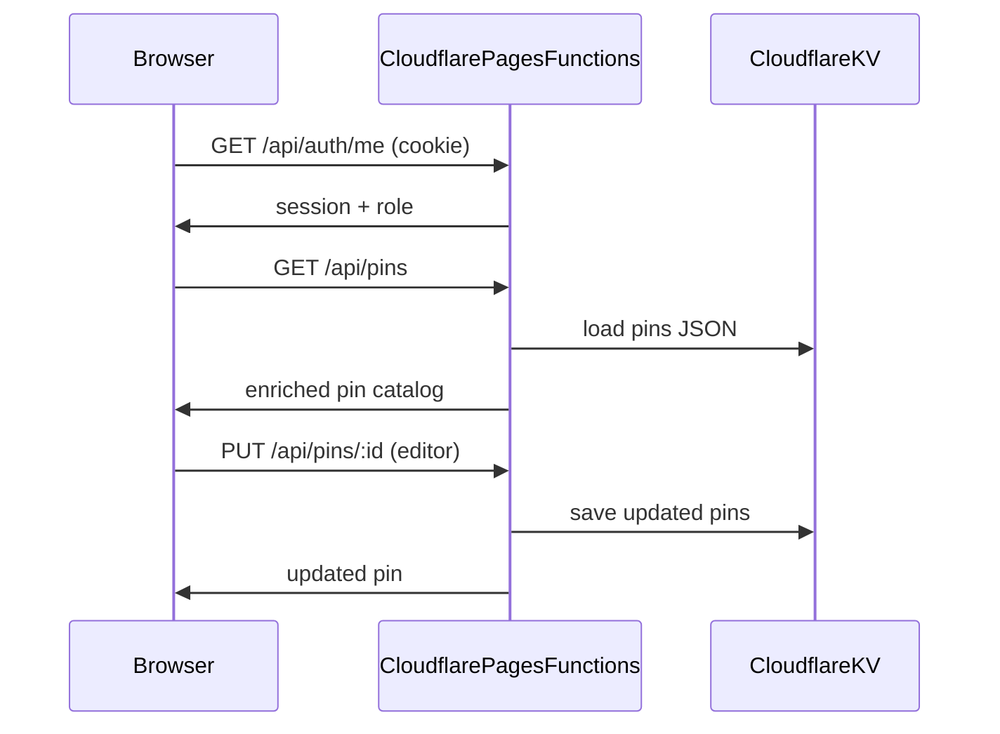

# HLL Tactika — Project Knowledge

## What this project is

**HLL Tactika** is a private, Steam-authenticated web app for a competitive circle. It maps trick spots — bush climbs, roof access, MG positions, etc. — across all 20 HLL tactical maps. Users pan/zoom high-res maps, filter pins, preview/play embedded videos, and (with the right role) add/edit pins in editor mode.

Inspired by [Maps Let Loose](https://mattw.io/maps-let-loose/) for map assets and spawn data. Branded as **HLL Tactika** (logo SVGs, Discord link `discord.gg/kDaK9wpr8y`).

---

## Core Language & Frontend Framework

| Aspect | Choice |
|--------|--------|
| Language | **Vanilla JavaScript (ES modules)** — no TypeScript, no bundler |
| Framework | **None** — not React, Vue, Angular, or Svelte |
| Architecture | Single-page app: [`index.html`](../index.html) shell + [`js/app.js`](../js/app.js) bootstrap |
| Module loading | Native `import`/`export`; dynamic imports for lazy loading (e.g. map modules in `app.js`) |
| State | Central mutable object in [`js/state.js`](../js/state.js) + `localStorage` for UI prefs (selected map, toggles, filters) |
| Event wiring | [`js/bind-ui.js`](../js/bind-ui.js) — centralized DOM event binding |
| Build step | **None** — static files served as-is; `"type": "module"` in [`package.json`](../package.json) |

**Key frontend modules:**
- `js/ui/` — map viewer, overlays, sidebar, pin markers/modals, auth gate, admin panel
- `js/editor/` — placement mode, drag, undo/redo, draft renderer, form handler
- `js/api/` — thin fetch wrappers for auth, pins, maps, admin
- `js/helpers/` — permissions, position codes, sanitizer, proximity layout
- `js/utils/` — video URL parsing, Medal.tv resolver

---

## Rendering Engine & Canvas Library

**No dedicated rendering engine** (no PixiJS, Konva, Fabric.js, Three.js, Leaflet, etc.).

The map is rendered with **DOM + CSS transforms**:

```js
// js/ui/map-viewer.js — applyTransform()
this.stage.style.transform = `translate(${this.translateX}px, ${this.translateY}px) scale(${this.scale})`;
```

- **Map image**: 1920×1920 WebP files in `maps/no-grid/`
- **Pan/zoom**: Custom `MapViewer` class — pointer drag, wheel zoom, clamp bounds, fit-to-view, sidebar-aware focal center
- **Overlays**: DOM layers — grid PNG (`maps/plain-grid.png`), strongpoint highlight images (`maps/points/`), label markers
- **Pins**: Absolutely positioned DOM elements on a map layer (percentage coords 0–100)
- **MG spot arrows**: Inline **SVG** geometry in [`js/ui/mg-spot-arrows.js`](../js/ui/mg-spot-arrows.js)
- **Canvas (minor)**: Used once in [`js/ui/map-overlays.js`](../js/ui/map-overlays.js) to rasterize strongpoint label text to a data URL — not the main render loop

---

## Real-Time Collaboration (The Backbone)

**There is no real-time collaboration layer.** No WebSockets, Socket.io, Yjs, Liveblocks, PartyKit, or similar.

Data flow is **request/response REST**:



- **Persistence**: Cloudflare KV (`PINS_KV` binding in [`wrangler.toml`](../wrangler.toml)); local dev falls back to in-memory store ([`functions/lib/pins-store.js`](../functions/lib/pins-store.js))
- **Concurrency**: Last-write-wins on the full pins JSON blob — no optimistic locking or live multi-user sync
- **Protection**: [`functions/_middleware.js`](../functions/_middleware.js) blocks direct access to `/data/pins.json`; pins only via authenticated `/api/pins`
- **Seed data**: [`data/pins.json`](../data/pins.json) shipped with repo; copied into KV on first prod load

If you expected a collaborative canvas backbone, this project uses **server-authoritative CRUD** instead.

---

## Backend & Hosting Infrastructure

| Layer | Technology |
|-------|------------|
| Hosting | **Cloudflare Pages** (static site, output dir `.`) |
| Serverless API | **Cloudflare Pages Functions** in `functions/` (Workers runtime) |
| Local dev | `wrangler pages dev .` → port 8788 |
| Deploy | `wrangler pages deploy` or [`scripts/deploy-cloudflare.ps1`](../scripts/deploy-cloudflare.ps1) |
| Storage | **Cloudflare KV** — pins + user allowlist (same `PINS_KV` namespace) |
| Config | [`wrangler.toml`](../wrangler.toml), secrets in `.dev.vars` / Cloudflare env vars |
| Dependencies | Only **Wrangler ^4.0.0** (devDependency) — zero runtime npm deps |

**API routes** (`functions/api/`):
- `GET/POST /api/pins`, `PUT/DELETE /api/pins/:pinId`
- `GET /api/auth/steam`, `GET /api/auth/callback`, `GET /api/auth/me`, `POST /api/auth/logout`
- `GET/POST /api/admin/users`, `DELETE/PATCH /api/admin/users/:steamId`
- `GET /api/medal/resolve?url=` — Medal.tv clip proxy

**Shared libs** (`functions/lib/`): session, steam OpenID, roles, auth middleware, pins/users stores, response helpers, Medal resolver.

**Data assets** (not API):
- [`data/map-spawns.json`](../data/map-spawns.json) — 20 maps, grid + strongpoint coords (~5500 lines)
- [`data/strongpoint-names.json`](../data/strongpoint-names.json) — sector labels
- Generated by Python scripts from [maps-let-loose](https://github.com/mattwright324/maps-let-loose)

**Legacy**: Plain `python -m http.server` still works for map asset testing but cannot load protected pins.

---

## Icons & Asset Libraries

| Asset type | Source |
|------------|--------|
| UI icons | **Font Awesome 6.5.1** via CDN (`cdnjs.cloudflare.com`) — `fa-solid`, `fa-map-pin`, `fa-person-rifle`, etc. |
| Brand logos | Local SVGs: `assets/logos/tactika-full-logo.svg`, `tactika-logo.svg`, faction logos (`axis.svg`, `allies.svg`, `neutral.svg`) |
| Map images | 20× WebP tactical maps (`maps/no-grid/*_NoGrid.webp`) |
| Overlays | `maps/plain-grid.png`, strongpoint PNGs in `maps/points/` |
| Welcome/bye videos | `assets/welcome/welcome.mp4`, `assets/welcome/bye.mp4` |
| Fonts | **Texta / Texta Alt** — self-hosted TTF in `assets/fonts/`, loaded via [`css/fonts/texta.css`](../css/fonts/texta.css) |

No icon component library (Lucide, Heroicons, etc.) beyond Font Awesome.

---

## Styling & UI Framework

| Aspect | Choice |
|--------|--------|
| CSS framework | **None** — no Tailwind, Bootstrap, Material UI |
| Approach | Hand-written modular CSS: `css/base.css`, `layout.css`, `utilities.css`, `css/components/*`, `css/editor/*` |
| Theming | CSS custom properties in `:root` — dark military palette, accent gold `#c4a35a`, pin tag colors (climb green, MG red, faction blues) |
| Glass UI | Custom **glassmorphism** system in [`css/components/glass.css`](../css/components/glass.css) — blur, borders, pill inputs, panels |
| Layout | CSS Grid — sidebar + map area + header ([`css/layout.css`](../css/layout.css)) |
| Responsive | Portrait layout handling via `chrome-panels.js` |
| Animations | Welcome typewriter, sidebar transitions, map bg fade/hue controls |

---

## Authentication & Security

| Aspect | Implementation |
|--------|----------------|
| Identity | **Steam OpenID** ([`functions/lib/steam.js`](../functions/lib/steam.js)) |
| Session | **HMAC-SHA256 signed cookie** (`hll_session`), 7-day TTL, HttpOnly, SameSite=Lax ([`functions/lib/session.js`](../functions/lib/session.js)) |
| Authorization | **Steam ID allowlist** with role hierarchy: `owner > admin > assist > editor > viewer` ([roles.md](roles.md), [`functions/lib/roles.js`](../functions/lib/roles.js)) |
| Bootstrap | Env vars: `OWNER_STEAM_IDS`, `ADMIN_STEAM_IDS`, `ASSIST_STEAM_IDS`, `EDITOR_STEAM_IDS`, `VIEWER_STEAM_IDS` |
| Admin UI | KV-backed user list; owners can change roles; admins can add/remove lower roles |
| Server enforcement | `requireAuth`, `requireAdmin`, `requireOwner` in [`functions/lib/auth-request.js`](../functions/lib/auth-request.js); pin mutations checked in [`functions/lib/pin-permissions.js`](../functions/lib/pin-permissions.js) |
| Client checks | [`js/helpers/permissions.js`](../js/helpers/permissions.js) — UI gating only; server is source of truth |
| XSS mitigation | [`js/helpers/sanitizer.js`](../js/helpers/sanitizer.js) — manual HTML escaping |
| Secrets | `SESSION_SECRET` required; optional `STEAM_API_KEY` for profile names/avatars |
| Data access | Non-allowlisted Steam users get 403; middleware hides raw pin JSON |

**Role capabilities (summary):**
- **viewer** (Comp Member): read-only, no editor mode
- **editor** (Comp Advisor): own pins only
- **assist** (Comp Assist): any pin including seed pins
- **admin** (Comp Admin): + member management panel
- **owner**: + role changes, full control

---

## Other Important Details

### Domain features
- **20 HLL maps** with selector, default `SMDMV2` (Saint Marie du Mont)
- **Pin tags**: `mg-spot` (directional arrows) and `climb` ([`js/pin-tags.js`](../js/pin-tags.js))
- **Faction filtering**: axis / allies / neutral
- **Video support**: YouTube, Vimeo, direct MP4/WebM, Discord CDN attachments, Medal.tv (via backend proxy)
- **Multi-media pins**: `mediaItems` array (images + videos) with carousel in modal
- **Position codes**: Grid refs like `#M78-58` ([`js/helpers/position-code.js`](../js/helpers/position-code.js))
- **Editor tools**: click-to-place, drag pins (browse + draft), Ctrl+W/Y undo/redo, context menus, MG head/bar separation validation
- **Welcome flow**: Cinematic welcome page with scrub video, typewriter text, auth gate overlay
- **Admin panel**: User CRUD, role display names ("Comp Member", "Comp Advisor", etc.)

### Data model (pin)
- `id`, `title`, `description`, `tag`, `x`, `y` (%), `videoUrl`, optional `thumbnail`, `faction`, `requires` (truck/repair-station/barricade), `dirX`/`dirY` for MG spots, `createdBy` (Steam ID or `null` for seed pins), optional `mediaItems`

### Tooling & scripts
- Python: [`scripts/extract-map-data.py`](../scripts/extract-map-data.py), [`scripts/extract-sp-names.py`](../scripts/extract-sp-names.py) (Pillow)
- PowerShell deploy script for Cloudflare Pages setup

### Project structure reference
- Full tree documented in [folder-structure.md](folder-structure.md)

### Planned / TODO (from README)
- MG spots (partially implemented), pin type tags, custom spot names

### What this project is NOT
- Not a npm-heavy frontend monorepo
- Not a collaborative whiteboard / live-sync app
- Not usable on GitHub Pages alone (needs Cloudflare Functions for auth + pins)
- Not a game mod or in-game overlay — standalone browser tool
