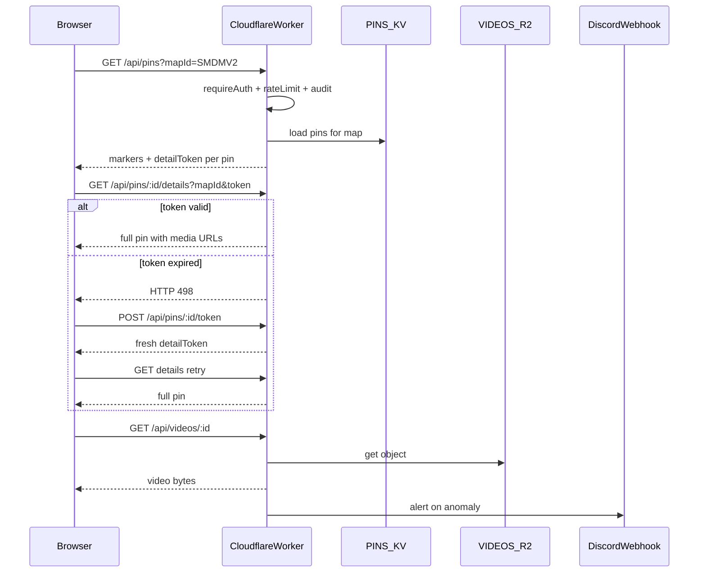

# Hybrid Anti-Exfiltration — Implementation Instructions

Instructions only — no code snippets. Implement by reading existing patterns in cited files.

---

## Executive summary (read this first)

**Problem:** Today [`GET /api/pins`](../functions/api/pins.js) returns the entire catalogue (all maps, all fields, all media URLs) to any member. One request = portable clone.

**Solution:** Split data into four access tiers:

1. **Markers** (per map) — render map UI, sidebar, filters; thumbnail + title; no video/media arrays, no description, no creator.
2. **Details** (per pin, token-gated) — full record including `videoUrl`, `mediaItems`, `description`, `createdBy`.
3. **Silent token refresh** (per pin) — invisible to user; keeps long sessions working without re-loading the whole map.
4. **Full export** (owner only) — complete backup JSON for ops.

Plus: **rate limits** (hard 429), **audit log** (forensics), **Discord alerts** (notify admins; no auto-block).

**After deployment:** A member cannot dump full JSON + videos in one request. Long play sessions (hours, many pins) remain smooth via 20-minute tokens and silent refresh. Once revoked, their site cannot call your API.

---

## Locked decisions (do not change without owner approval)

These are final product/security choices. All numeric values remain **env-configurable** via [`functions/lib/security-config.js`](../functions/lib/security-config.js) but defaults below are the agreed baseline.

### Marker endpoint

`GET /api/pins?mapId=...` (e.g. `mapId=SMDMV2`)

| Included | Excluded |
|----------|----------|
| `id`, `x`, `y`, `tag`, `faction`, `dirX`, `dirY`, `thumbnail`, `title`, `requires`, `detailToken` | `description`, `createdBy`, `createdByName`, `videoUrl`, `mediaItems`, `sourceDiscordMessageId` |

- Sidebar and map labels work from markers alone.
- Hover preview may use marker `thumbnail` for static images; video playback still requires detail fetch.
- **Description search disabled.** Search by **title, tag, position code** only.

### Detail endpoint

`GET /api/pins/:pinId/details?mapId=...&token=...`

- Returns full pin: description, video, media items, creator, etc.
- Protected by stateless HMAC token signed with **`PIN_DETAIL_SECRET`** (separate from `SESSION_SECRET`; both must be set in production).
- Token TTL: **20 minutes** (default `DETAIL_TOKEN_TTL_SEC=1200`).
- Tokens are **user-bound and pin-specific** (`pinId` + `mapId` + `steamId` in payload). Cannot be reused across users or pins.
- On **expired or invalid token**, return **HTTP 498** (non-standard; client treats as “refresh token and retry”). Do not use 403 for expiry — 498 triggers silent refresh only.

### Silent token refresh

`POST /api/pins/:pinId/token` with body `{ mapId }` (or `mapId` query param — pick one and document)

- Called automatically by frontend when detail fetch returns **498**.
- Returns `{ detailToken }` — fresh 20-minute token for that pin.
- Client retries detail fetch immediately; **completely invisible to the user** (no toast, no modal, no reload).
- Rate limit: **30 requests/minute** per session — never hit in normal use; supports rapid pin browsing during long play sessions.
- Requires valid session (`requireAuth`); verify pin exists on given map.
- Does **not** return full pin data — token only.

**Rationale:** Users keep the site open for hours while playing and open many pins quickly. Re-fetching entire map markers on token expiry would be disruptive; per-pin refresh is cheaper and invisible.

### Owner full export

`GET /api/admin/pins-full`

- **Owner only** (`requireOwner`).
- Returns entire catalogue, all fields, all maps.
- Rate limit: **5 requests/hour**.

### Rate limits (hard 429)

| Endpoint | Limit | Window |
|----------|-------|--------|
| Map markers `GET /api/pins?mapId=` | 10 | 1 min |
| Pin details `GET /api/pins/:id/details` | 20 | 1 min |
| Silent refresh `POST /api/pins/:id/token` | 30 | 1 min |
| Media `GET /api/videos/*`, `GET /api/images/*` | 60 | 1 hour |
| Owner export `GET /api/admin/pins-full` | 5 | 1 hour |

On 429: return `Retry-After` header. Log for alert counters.

**Validated use case:** “Streamer scenario” — 20 detail views in 2–3 minutes uses ≤ 50% of the detail limit (20/min). Long sessions with occasional token refreshes stay well under refresh limit (30/min).

### Alert thresholds (Discord webhook; notify only, no auto-revoke)

| Signal | Threshold | Window |
|--------|-----------|----------|
| Detail fetches | > 100 | 1 hour |
| Distinct maps loaded | ≥ 15 | 15 min |
| Consecutive 429 responses | ≥ 5 | 10 min |

- Env: `ALERT_DISCORD_WEBHOOK_URL` (optional; alerts skipped if unset). Comma-separated for multiple webhooks (same message to all).
- Debounce duplicate alerts ~30 min per user per signal type.
- Manual revoke via existing admin panel.

### Token security

- **`PIN_DETAIL_SECRET` required** in production — do not fall back to `SESSION_SECRET`.
- Same HMAC-SHA256 + base64url approach as [`functions/lib/session.js`](../functions/lib/session.js).
- No owner bypass on detail endpoint unless explicitly needed later; owner uses `/api/admin/pins-full` for bulk access.

### Search

- **Disabled:** description.
- **Enabled:** title, tag, position code.

---

## Architecture

### API surface (after change)

| Method | Path | Auth | Returns |
|--------|------|------|---------|
| `GET` | `/api/pins` (no query) | any member | **403** — bulk export not allowed |
| `GET` | `/api/pins?mapId=X` | any member | Markers for one map |
| `GET` | `/api/pins/:pinId/details?mapId=X&token=T` | member + valid token | Full pin |
| `POST` | `/api/pins/:pinId/token` | member | `{ detailToken }` only |
| `GET` | `/api/admin/pins-full` | **owner** only | Full catalogue |
| `GET` | `/api/admin/access-alerts` | admin/owner | Recent audit events (optional v1.1) |
| `POST` | `/api/pins` | editor+ | unchanged |
| `PUT` | `/api/pins/:pinId` | editor+ | unchanged |
| `DELETE` | `/api/pins/:pinId` | editor+ | unchanged |
| `GET` | `/api/videos/:id` | any member | unchanged + rate limit |
| `GET` | `/api/images/:id` | any member | unchanged + rate limit |

---

## Data shapes

### Marker pin (per-map response)

Response wrapper: `{ mapId, pins: [...] }`.

**Per pin:** `id`, `title`, `tag`, `x`, `y`, `faction`, `requires`, `thumbnail` (URL string when present), `detailToken`, and for MG spots `dirX`, `dirY` when valid.

**Omit:** `description`, `videoUrl`, `mediaItems`, `createdBy`, `createdByName`, `sourceDiscordMessageId`.

**Optional helper field:** `hasMedia` boolean may be derived server-side for `pin--no-media` styling if thumbnail alone is insufficient (e.g. video-only pin with no thumbnail). Prefer deriving from stored pin before building marker.

**Enrichment:** Do not call Steam profile enrichment for marker responses — creator fields are not exposed at this tier.

### Detail pin (full record)

Same fields as current KV pin after enrichment via [`functions/lib/pin-creators.js`](../functions/lib/pin-creators.js).

### Token refresh response

`{ detailToken: string }` — new 20-minute token only.

### Owner full export

Full `defaultMapId` + `pins` object (all maps, all fields), plus `exportedAt` ISO timestamp and `exportedBy` Steam ID.

---

## Configuration (env vars)

Add to Cloudflare Pages → Settings → Environment variables. Document in [`README.md`](../README.md).

**Create** [`functions/lib/security-config.js`](../functions/lib/security-config.js) exporting `getSecurityConfig(env)`:

| Variable | Required | Default | Purpose |
|----------|----------|---------|---------|
| `PIN_DETAIL_SECRET` | **Yes** (prod) | — | HMAC signing for detail tokens |
| `DETAIL_TOKEN_TTL_SEC` | No | `1200` (20 min) | Token lifetime |
| `RATE_LIMIT_MAP_PER_MIN` | No | `10` | Map marker GET |
| `RATE_LIMIT_DETAIL_PER_MIN` | No | `20` | Detail GET |
| `RATE_LIMIT_TOKEN_PER_MIN` | No | `30` | Silent token POST |
| `RATE_LIMIT_MEDIA_PER_HOUR` | No | `60` | Video/image GET |
| `RATE_LIMIT_ADMIN_EXPORT_PER_HOUR` | No | `5` | Owner full export |
| `ALERT_DETAIL_PER_HOUR` | No | `100` | Discord alert threshold |
| `ALERT_MAPS_IN_WINDOW` | No | `15` | Map sweep alert |
| `ALERT_MAP_WINDOW_MIN` | No | `15` | Window for map alert |
| `ALERT_429_COUNT` | No | `5` | Consecutive 429 alert |
| `ALERT_429_WINDOW_MIN` | No | `10` | Window for 429 alert |
| `ALERT_DISCORD_WEBHOOK_URL` | No | — | Discord webhook(s); comma-separated OK |
| `AUDIT_ENABLED` | No | `true` | Toggle audit log |
| `AUDIT_MAX_EVENTS` | No | `500` | KV audit list cap |

Add HTTP **498** helper in [`functions/lib/response.js`](../functions/lib/response.js) for expired detail tokens (e.g. `tokenExpiredResponse(message)`).

---

## Backend implementation

### 1. Pin field helpers

**Modify** [`functions/lib/pin-fields.js`](../functions/lib/pin-fields.js):

- `pinHasStoredMedia(pin)` — true if pin has video, thumbnail, or mediaItems.
- `toPinMarker(pin, detailToken)` — build marker per Locked decisions; include `thumbnail` when stored; include `dirX`/`dirY` for mg-spot only.
- `toPinDetail(pin)` — full pin for detail responses.

### 2. Detail token (HMAC)

**Create** [`functions/lib/pin-detail-token.js`](../functions/lib/pin-detail-token.js):

- Mirror [`functions/lib/session.js`](../functions/lib/session.js) signing pattern.
- Payload: `pinId`, `mapId`, `steamId`, `exp`.
- `createDetailToken`, `verifyDetailToken`.
- `verifyDetailToken` returns distinct result for **expired** vs **invalid** so detail handler can emit 498 vs 403.

### 3. Rate limiting

**Create** [`functions/lib/rate-limit.js`](../functions/lib/rate-limit.js):

- KV keys: `rl:{bucket}:{steamId}:{windowKey}`.
- Buckets: `map`, `detail`, `token`, `media`, `admin_export`.
- `checkRateLimit`, `incrementRateLimit`; 429 with `Retry-After`.

### 4. Access guard, audit, alerts

**Create** [`functions/lib/access-guard.js`](../functions/lib/access-guard.js), [`functions/lib/audit-log.js`](../functions/lib/audit-log.js), [`functions/lib/alert-notify.js`](../functions/lib/alert-notify.js):

- Guard orchestrates rate limit → increment → audit → alert evaluation.
- Track **consecutive** 429s per steamId for alert threshold (reset counter on successful 200).
- Audit endpoints: `pins.map`, `pins.detail`, `pins.token`, `media.video`, `media.image`, `admin.export`.

### 5. Per-map markers GET

**Modify** [`functions/api/pins.js`](../functions/api/pins.js) `onRequestGet`:

1. `requireAuth`
2. Require `mapId` query; else **403** bulk export message
3. Access guard (`map` bucket)
4. Load pins for map only; **skip** full-catalogue enrichment
5. Issue `detailToken` per pin (20 min TTL); map via `toPinMarker`
6. Return `{ mapId, pins }`

`onRequestPost`: unchanged.

### 6. Pin detail GET

**Create** [`functions/api/pins/[pinId]/details.js`](../functions/api/pins/[pinId]/details.js):

1. `requireAuth`
2. `mapId` + `token` from query
3. Access guard (`detail` bucket)
4. Verify token → **498** if expired, **403** if invalid/tampered/wrong user or pin
5. `findPin` → 404 if missing
6. Enrich creator for this pin if needed; return `{ pin, mapId }`

### 7. Silent token refresh POST

**Create** [`functions/api/pins/[pinId]/token.js`](../functions/api/pins/[pinId]/token.js):

1. `requireAuth`
2. Read `mapId` from body or query
3. Access guard (`token` bucket)
4. `findPin` → 404 if missing
5. Issue new `detailToken` (20 min); return `{ detailToken }`
6. Audit log; no full pin in response

### 8. Owner full export

**Create** [`functions/api/admin/pins-full.js`](../functions/api/admin/pins-full.js):

- `requireOwner`, `admin_export` rate limit, audit always, full enriched catalogue.

### 9. Media endpoints

**Modify** [`functions/api/videos/[videoId].js`](../functions/api/videos/[videoId].js) and [`functions/api/images/[imageId].js`](../functions/api/images/[imageId].js):

- Access guard (`media` bucket) after `requireAuth`.

### 10. Middleware

[`functions/_middleware.js`](../functions/_middleware.js) — keep `/data/pins.json` blocked.

---

## Frontend implementation

Read [`js/app.js`](../js/app.js), [`js/ui/auth-gate.js`](../js/ui/auth-gate.js), [`js/api/pins.js`](../js/api/pins.js) first.

### 1. API client

**Modify** [`js/api/pins.js`](../js/api/pins.js):

- `fetchMapMarkers(mapId)` → `GET /api/pins?mapId=...`
- `fetchPinDetail(mapId, pinId, detailToken)` → `GET .../details?...`
- `refreshPinDetailToken(mapId, pinId)` → `POST .../token` with `{ mapId }`
- Keep create/update/delete unchanged

**Detail fetch with auto-refresh:** On response status **498**, call `refreshPinDetailToken`, update stored token on marker in `state.pinCatalog`, retry detail once. If second attempt fails, surface error only then (should be rare).

**Modify** [`js/api/admin.js`](../js/api/admin.js): `fetchFullPinsExport()` for owner backup.

### 2. Pin detail cache

**Create** [`js/helpers/pin-detail-cache.js`](../js/helpers/pin-detail-cache.js):

- In-memory cache keyed `mapId:pinId` for **full pin** objects after detail fetch.
- `resolvePinDetail(mapId, marker)` — cache hit → return; miss → detail fetch with refresh logic above.
- `updateMarkerToken(mapId, pinId, detailToken)` — update token in `state.pinCatalog` after silent refresh.
- No localStorage persistence.

### 3. Boot and map switching

**Modify** [`js/ui/auth-gate.js`](../js/ui/auth-gate.js): `loadMapMarkers(mapId)` replaces `loadProtectedPins`.

**Modify** [`js/app.js`](../js/app.js):

- Load markers for current map only at boot.
- `ensureMapMarkers(mapId)` before render on map switch.
- `reloadPinsForMap` refetches single map.
- Do not depend on bulk API `defaultMapId`; use [`data/pins.json`](../data/pins.json) or `loadSelectedMapId()`.

### 4. pinHasMedia

**Modify** [`js/helpers/pin-media.js`](../js/helpers/pin-media.js):

- Support marker shape: `hasMedia` if present, else infer from `thumbnail` or full media fields after detail merge.

### 5. Hover preview

**Modify** [`js/ui/pin-preview.js`](../js/ui/pin-preview.js):

- Static thumbnail from marker may render immediately when `marker.thumbnail` present.
- Video preview requires `resolvePinDetail` (debounce ~200ms).
- Token refresh via 498 is handled inside `resolvePinDetail` — no user-visible interruption.

### 6. Pin modal

**Modify** [`js/ui/pin-modal.js`](../js/ui/pin-modal.js):

- Async `openModal`: `resolvePinDetail` then render player.
- Show title from marker immediately; spinner in media area until detail loads.

### 7. Editor

**Modify** [`js/ui/pin-editor.js`](../js/ui/pin-editor.js) `startEditPin`:

- `resolvePinDetail` before filling description and media form.

### 8. Search

**Modify** [`js/ui/filter-bar.js`](../js/ui/filter-bar.js):

- Remove description from `pinMatchesSearch`.
- Update [`docs/user-guide.md`](user-guide.md).

### 9. After create/update/delete

- Update marker in `state.pinCatalog` (re-fetch map or patch from POST/PUT response).
- Update detail cache with full pin from mutation response.
- New tokens: re-fetch map markers OR issue new token server-side in mutation response (optional enhancement); minimum viable is `reloadPinsForMap` after save.

### 10. Owner export UI (optional v1)

**Modify** [`js/ui/admin-panel.js`](../js/ui/admin-panel.js): owner-only export button → download `pins-backup-{date}.json`.

---

## Rollout plan

### Phase 1 — Backend (preview)

1. Deploy new routes; optionally keep old bulk GET for owner-only comparison during testing.
2. Verify: bulk 403, markers with thumbnail + token, detail 200, expired token **498**, refresh POST, detail retry, 429 limits, owner export.

### Phase 2 — Frontend (preview)

1. Wire client to new API + silent refresh.
2. Run test checklist; validate streamer scenario (20 pins in few minutes).

### Phase 3 — Production

1. Remove legacy bulk GET.
2. Set `PIN_DETAIL_SECRET` and `ALERT_DISCORD_WEBHOOK_URL`.
3. Tune limits from first week of alerts.

---

## Test checklist

### Viewer

- [ ] App loads current map; no `/api/pins` without `mapId`
- [ ] Map switch fetches one map at a time
- [ ] Sidebar titles and requirement icons work from markers
- [ ] Hover: thumbnail from marker when available; video after detail
- [ ] Click pin → modal plays video
- [ ] Search title/tag/code works; description does not
- [ ] `fetch('/api/pins')` → 403
- [ ] Leave tab open >20 min, open pin → silent refresh, no error toast

### Streamer scenario

- [ ] Open 20 pins in 2–3 minutes → no 429; smooth playback

### Editor

- [ ] Create/edit/delete/drag/undo unchanged

### Owner

- [ ] `/api/admin/pins-full` works; 5/hour limit enforced

### Security

- [ ] Tampered token → 403 (not 498)
- [ ] Expired token → 498 → auto POST token → detail succeeds
- [ ] Consecutive 429s → Discord alert (test with lowered thresholds)
- [ ] Revoked member → 401/403 on all routes

---

## Files to create

| File | Purpose |
|------|---------|
| [`functions/lib/security-config.js`](../functions/lib/security-config.js) | Env-based limits |
| [`functions/lib/pin-detail-token.js`](../functions/lib/pin-detail-token.js) | HMAC tokens |
| [`functions/lib/rate-limit.js`](../functions/lib/rate-limit.js) | KV counters |
| [`functions/lib/access-guard.js`](../functions/lib/access-guard.js) | Orchestration |
| [`functions/lib/audit-log.js`](../functions/lib/audit-log.js) | Event log |
| [`functions/lib/alert-notify.js`](../functions/lib/alert-notify.js) | Discord alerts |
| [`functions/api/admin/pins-full.js`](../functions/api/admin/pins-full.js) | Owner export |
| [`functions/api/pins/[pinId]/details.js`](../functions/api/pins/[pinId]/details.js) | Detail GET |
| [`functions/api/pins/[pinId]/token.js`](../functions/api/pins/[pinId]/token.js) | Silent refresh POST |
| [`js/helpers/pin-detail-cache.js`](../js/helpers/pin-detail-cache.js) | Client cache + refresh |

## Files to modify

| File | Change |
|------|--------|
| [`functions/lib/pin-fields.js`](../functions/lib/pin-fields.js) | Marker/detail helpers |
| [`functions/lib/response.js`](../functions/lib/response.js) | 498 helper |
| [`functions/api/pins.js`](../functions/api/pins.js) | Per-map GET |
| [`functions/api/videos/[videoId].js`](../functions/api/videos/[videoId].js) | Rate limit + audit |
| [`functions/api/images/[imageId].js`](../functions/api/images/[imageId].js) | Rate limit + audit |
| [`js/api/pins.js`](../js/api/pins.js) | Fetchers + 498 retry |
| [`js/api/admin.js`](../js/api/admin.js) | Owner export |
| [`js/ui/auth-gate.js`](../js/ui/auth-gate.js) | `loadMapMarkers` |
| [`js/app.js`](../js/app.js) | Per-map loading |
| [`js/helpers/pin-media.js`](../js/helpers/pin-media.js) | Marker thumbnail support |
| [`js/ui/pin-preview.js`](../js/ui/pin-preview.js) | Marker thumb + detail |
| [`js/ui/pin-modal.js`](../js/ui/pin-modal.js) | Async detail |
| [`js/ui/pin-editor.js`](../js/ui/pin-editor.js) | Detail before edit |
| [`js/ui/filter-bar.js`](../js/ui/filter-bar.js) | No description search |
| [`js/ui/admin-panel.js`](../js/ui/admin-panel.js) | Export button |
| [`README.md`](../README.md) | Env vars (`PIN_DETAIL_SECRET`, etc.) |
| [`docs/project-overview.md`](project-overview.md) | Architecture |
| [`docs/user-guide.md`](user-guide.md) | Search behavior |

---

## What this does NOT solve

- Screenshots / screen recording (accepted).
- Third-party video URLs copied from detail response.
- Patient scripted scrape while still a member (slowed + alerted, not impossible).
- Data already copied before revoke.

---

## Estimated effort

| Phase | Effort |
|-------|--------|
| Backend (API split, tokens, 498, refresh, limits) | 1.5–2 days |
| Frontend (cache, silent refresh, async UI) | 1.5–2 days |
| Audit + Discord | 0.5–1 day |
| Owner export + docs | 0.5 day |
| Testing + tuning | 0.5–1 day |
| **Total** | **~4–6 days** |

---

## Agent handoff notes

1. **`PIN_DETAIL_SECRET` is mandatory** — fail fast at startup or first token operation if missing in production.
2. **498 is intentional** — document in [`docs/api.md`](api.md); client must handle only expired tokens, not all errors.
3. Silent refresh must be **silent** — no UI feedback on successful 498 → POST → retry chain.
4. Markers include **`thumbnail`** — do not strip; video URLs and `mediaItems` stay detail-only.
5. Confirm Cloudflare Pages routing for `[pinId]/details.js` and `[pinId]/token.js` nested paths.
6. All limits read from `getSecurityConfig` — no magic numbers in handlers.
