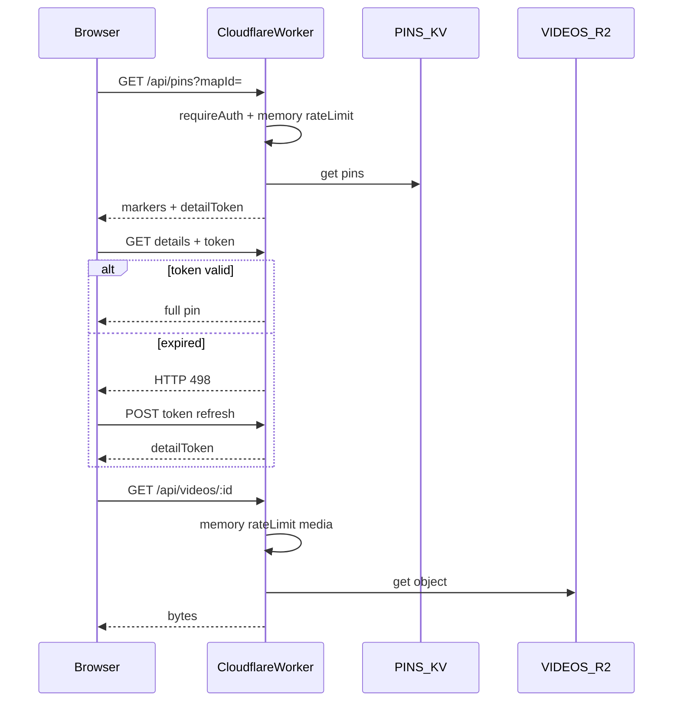

# Security model (as-built)

Invite-only anti-exfiltration for HLL Tactika on Cloudflare Pages/Workers (free-tier aware).

This document describes **what the code does today**. For API shapes see [api.md](api.md). For roles see [roles.md](roles.md).

---

## Goals

1. **No public scrape** — Steam session required; only allowlisted Steam IDs.
2. **No one-shot catalogue dump** — members get per-map markers; full media needs a pin-scoped token.
3. **Throttle burst abuse** — in-memory rate limits return HTTP 429 (not stored in KV).
4. **Minimize KV writes** — browsing does not write KV; pin mutations are intentional saves only.

---

## Access tiers

| Tier | Who | What |
|------|-----|------|
| Markers | Any member | `GET /api/pins?mapId=` — coords, title, tag, faction, thumbnail, `detailToken`; no description / video / mediaItems / creator |
| Details | Member + valid HMAC token | `GET /api/pins/:id/details` — full pin including media URLs |
| Token refresh | Member | `POST /api/pins/:id/token` — fresh `detailToken` only (client uses on HTTP **498**) |
| Full export | Owner | `GET /api/admin/pins-full` — entire catalogue |
| Mutate pins | Editor+ (ownership rules) | `POST/PUT/DELETE /api/pins…`, `PATCH /api/pins` (batch) |

- Token TTL: **20 minutes** (`DETAIL_TOKEN_TTL_SEC`, default `1200`).
- Tokens are bound to `pinId` + `mapId` + `steamId`, signed with **`PIN_DETAIL_SECRET`** (required; never fall back to `SESSION_SECRET`).
- Bulk `GET /api/pins` without `mapId` → **403**.

Search: title / tag / position code only (no description search).

---

## What’s enforced

### Still active

- Steam OpenID session + role allowlists ([`functions/lib/roles.js`](../functions/lib/roles.js), [`users-store.js`](../functions/lib/users-store.js)).
- Marker / detail / token / owner-export split ([`functions/api/pins.js`](../functions/api/pins.js), [`pins/[pinId]/details.js`](../functions/api/pins/[pinId]/details.js), [`token.js`](../functions/api/pins/[pinId]/token.js), [`admin/pins-full.js`](../functions/api/admin/pins-full.js)).
- **In-memory rate limits** via [`guardAccess`](../functions/lib/access-guard.js) + [`rate-limit.js`](../functions/lib/rate-limit.js) when a `bucket` is set. Zero KV reads/writes for limits.
- Pin edit permissions (`canModifyPin` / editor roles).
- Admin Discord **probe only**: `POST /api/admin/alert-test` ([`alert-test.js`](../functions/api/admin/alert-test.js)) using webhook helpers in [`alert-notify.js`](../functions/lib/alert-notify.js).

### Removed / not on the hot path (free-tier KV)

| Former feature | Status |
|----------------|--------|
| Per-request KV audit log (`audit:log`) | **Not written** on browse/mutate guards |
| Discord map-sweep / detail-flood / consecutive-429 alerts | **Removed** from `guardAccess` |
| KV-backed rate-limit keys (`rl:…`) | **Removed** — memory Map only (per Worker isolate) |
| Browse-time thumbnail auto-persist to KV | **Disabled** on the client; thumbnails persist on editor save |

Legacy modules/config knobs may still exist (`audit-log.js`, `AUDIT_*`, `ALERT_DETAIL_*` in [`security-config.js`](../functions/lib/security-config.js)) but are **not driving browse behaviour**. Prefer leaving unused env vars unset.

---

## Rate limits (HTTP 429 + `Retry-After`)

Defaults from [`security-config.js`](../functions/lib/security-config.js) (all env-overridable):

| Bucket | Typical endpoints | Default |
|--------|-------------------|---------|
| `map` | `GET /api/pins?mapId=` | 20 / min |
| `detail` | `GET /api/pins/:id/details` | 30 / min |
| `token` | `POST /api/pins/:id/token` | 30 / min |
| `media` | `GET /api/videos/*` | 10 / min |
| `medal` | `GET /api/medal/resolve` | 20 / min |
| `auth` | Steam callback / logout | 20 / min |
| `admin` | Admin user APIs, alert-test | 30 / min |
| `prefs` | Preferences | 30 / min |
| `admin_export` | `GET /api/admin/pins-full` | 10 / hour |

**Not rate-limited** (auth only): `GET /api/images/*`, pin create/update/delete/batch (guard called with no `bucket`), thumbnail POST.

**Caveat:** Memory limits are **per Cloudflare isolate**, not a global durable counter. Casual floods still often hit 429; determined allowlisted users can partially bypass by spreading load across isolates. Acceptable for a small invite community on free tier.

---

## KV write budget (security-relevant)

| Action | KV writes |
|--------|-----------|
| Map load / pin detail / video / token refresh | **0** (reads only for pins) |
| Pin create / update / delete | **1** (`pins` key) |
| Batch nudge flush (`PATCH /api/pins`) | **1** for many pins |
| Editor form autosave while typing | **None** — client saves on back arrow |
| Browse drag | **Local until** editor exit / batch flush |

R2 uploads (video/image files) are separate from KV write quotas.

---

## Architecture (browse)

No Discord / audit side effects on this path.

---

## Threat model (honest)

| Threat | Mitigation |
|--------|------------|
| Anonymous scraper | Steam + allowlist |
| Member dumping all videos in one call | Marker/detail split + tokens |
| Burst scraping by member | Soft memory 429s |
| Long-running determined member clone | Possible if patient; rely on invitation policy |
| Abuse detection / forensics | **Weakened** — no live Discord abuse alerts or KV audit trail |
| Cross-edge hard throttle | **Not available** without paid durable limits / WAF |

---

## Env (security)

**Required**

- `SESSION_SECRET`
- `PIN_DETAIL_SECRET`
- Role allowlists (`OWNER_STEAM_IDS`, etc.)

**Optional**

- `ALERT_DISCORD_WEBHOOK_URL` — admin alert-test only
- `RATE_LIMIT_*` — override defaults above
- `DETAIL_TOKEN_TTL_SEC`

Do not document unused alert-threshold envs as active behaviour.

---

## Related files

| Area | Path |
|------|------|
| Guard | [`functions/lib/access-guard.js`](../functions/lib/access-guard.js) |
| Rate limit (memory) | [`functions/lib/rate-limit.js`](../functions/lib/rate-limit.js) |
| Config | [`functions/lib/security-config.js`](../functions/lib/security-config.js) |
| Tokens | [`functions/lib/pin-detail-token.js`](../functions/lib/pin-detail-token.js) |
| Discord probe helpers | [`functions/lib/alert-notify.js`](../functions/lib/alert-notify.js) |
| Client save-on-back / dirty batch | [`js/helpers/pin-persist.js`](../js/helpers/pin-persist.js), [`js/editor/form-handler.js`](../js/editor/form-handler.js) |

Historical implementation notes previously lived in this file and in `security-hybrid-plan.md`; treat **this document** as the source of truth for current behaviour.
