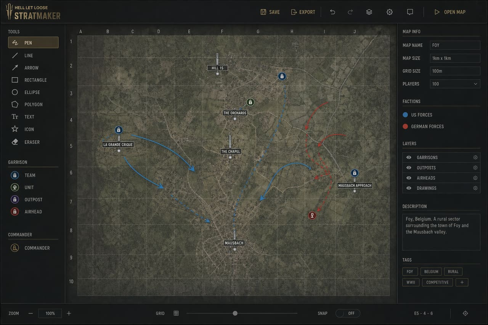

# Stratmaker

**Goal:** build multi-slide tactical decks on HLL maps and attach them to matches.

## Open Stratmaker

Hub → **Stratmaker** (strat catalog), then open or create a strat. Editor chrome matches the hub (avatar + **?** help).

## Catalog

- Folders, search, drag-and-drop organization
- Metadata: title, team (jr/sr), type, notes, match info
- Per-tool **lock** (creator / admin / owner) — view-only when locked

## Draw on a slide

| Tool / feature | Notes |
|----------------|--------|
| Pen, line, curve, shapes, text | Shift/Alt modifiers for snap / proportional / from-center |
| Icons & HLL placeables | Garrisons, vehicles, classes, StratSketch-style pack |
| Ping, eraser, colors | Stroke/fill options |
| Clipboard | Copy/cut/paste, duplicate, undo/redo, nudge |

*Stratmaker: map canvas, draw tools, and slide/deck chrome.*

### HLL helpers

- Spawn / garrison radius checks
- Optional **route plan** embed (read-only overlay + deep link) when a plan matches map + faction

## Collaboration

Multiple editors on the same slide sync live (Yjs). Watch peer presence so you don’t overwrite each other blindly.

## Link to a match

1. From the editor side panel, link a calendar event — **or**
2. Attach the strat from **Match Brief**.

Locked events/tools block edits until unlocked by an allowed role.

## Related

- [Calendar & Match Brief](Calendar-and-Match-Brief)
- [Routeplanner](Routeplanner)
- [Roles & permissions](Roles-and-Permissions)
